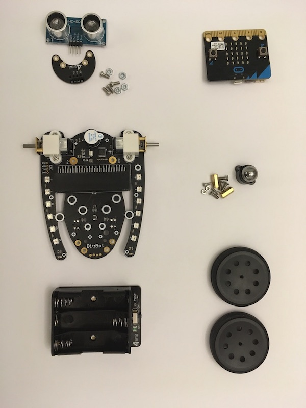
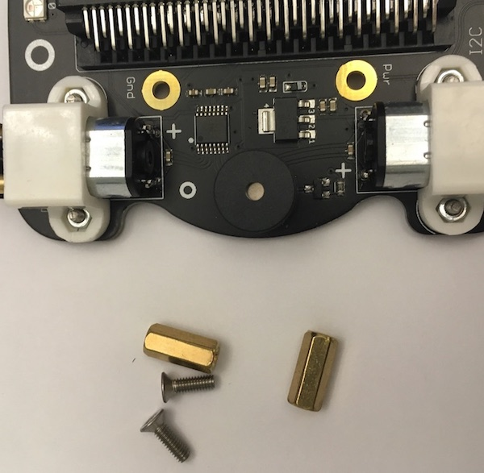
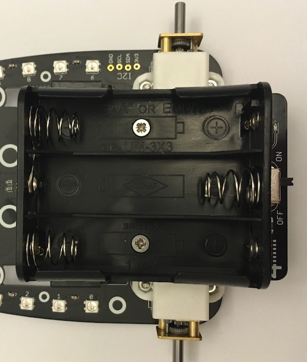
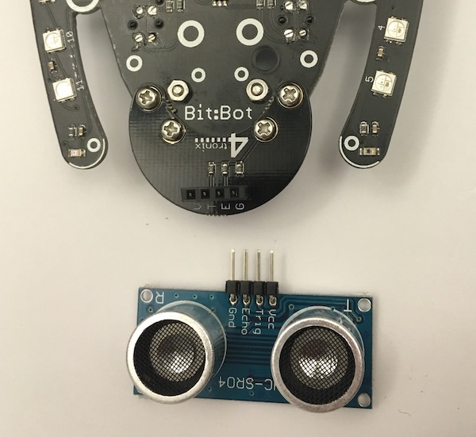
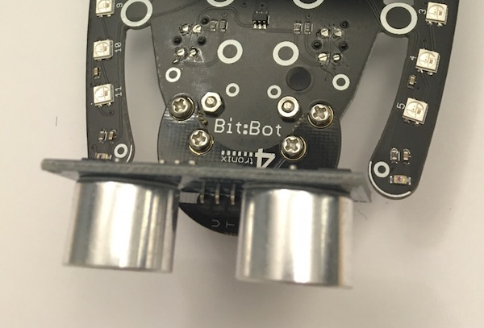

# Oppgave: Bygging

Man trenger bare en skrutrekker for å montere sammen BitBot bilen.

Det første vi skal gjøre er å montere styringskulen foran på bilen.

Skru fast plastholderen med to skruer og to muttere.

Plasser så kulen inn i plastholderen.

Deretter skal vi montere batteriholderen med to skruer og to avstandsmuttere.

Pass på at selve av/på bryteren er bak på bilen.

Monter så begge hjulene.

## Ekstra

Selve avstandsmåleren skal vi ikke montere først, men kan gjøre det senere.
Når vi programmerer bilen vil denne bare være i veien.

Monter holderen med 4 skruer og 4 muttere.

Etter det kan man plassere avstandsmåleren inn i kontakten med de fire hullene.
Vær forskitig - pinnene kan lett brekke hvis man er uforsiktig.

