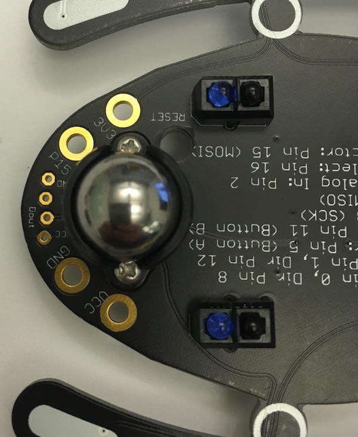
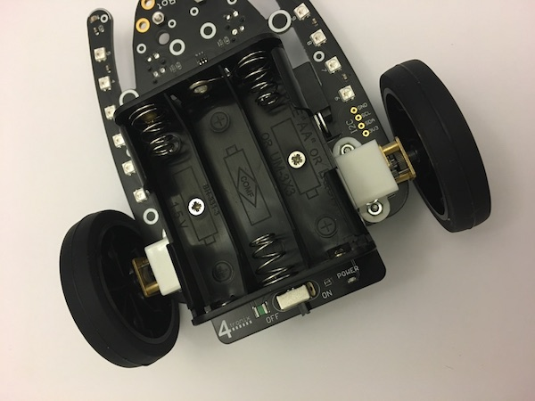

# Oppgave: Bygging

Man trenger bare en skrutrekker for å montere sammen BitBot bilen.

Det første vi skal gjøre er å montere styringskulen foran på bilen.

Skru fast plastholderen med to skruer og to muttere.

Plasser så kulen inn i plastholderen.

Deretter skal vi montere batteriholderen med to skruer og to avstandsmuttere.
Pass på at selve av/på bryteren er bak på bilen.

