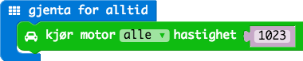

# Oppgave: Linjeføler

* Kjøre rett på en linje.
* Justere banen ved hjelp av linjefølere.

* Blinke med venstre lys når den treffer venstre sensor og omvendt.
* Prøv å rygge rundt banen.
* Ved bump - alarm med regnbuefarger.

## Ferdig Kode

Her finner du ferdig JavaScript kode som man kan kopere inn i kode-feltet:

* [Kjøre på linje](code-1.js)
* [Med lys](code-2.js)
* [Rygge](code-3.js)
* [Regnbuekrasj](code-4.js)
