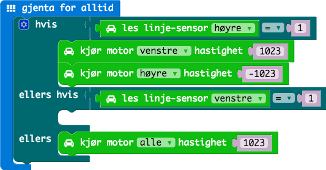
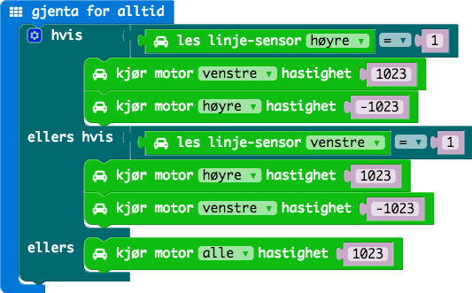

# Oppgave: Linjeføler

I denne oppgaven skal vi lage kode som kjører bilen rundt av seg selv
på en bane. Bilen har to linjefølere som kan sjekke om man bryter en linje.
Disse skal vi bruke for å holde bilen kjørende automatisk på en linje.

Først lar vi bilen kjøre fremover i full fart på begge hjulene.

Vi må så sjekke 3 tilstander: når den enen linjeføleren
brytes, når den andre brytes og når ingen (eller begge) brytes. Hvis
ingen (eller begge) brytes så kjører vi rett frem med begge hjulene.

Første tilstand sjekker vi om den høyre linjeføleren har tilstand `1`.

Andre tilstand sjekker vi om den venstre linjeføleren har tilstand `1`.

Ved første tilstand så skal vi svinge til høyre. Det betyr at vi lar venstre
motor gå forover, mens høyre motor rygger.

Ved andre tilstand så skal vi svinge til venstre. Høyre motor gå forover,
mens venstre motor rygger.

## Ekstra oppgaver

1. Lys med venstre lys når venstre linjeføler er høy (`1`). Og lys med høyre
  lys når høyre linjeføler er høy (`1`).

1. Rygge rundt banen i stedetfor å kjøre forover.

## Ferdig Kode

Her finner du ferdig JavaScript kode for oppgavene:

* [Kode](code.js)
