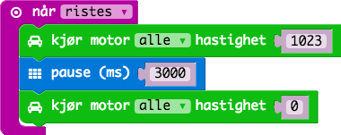
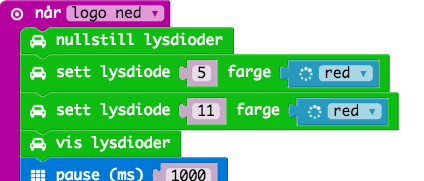

# Oppgave: Motorstyring

* Kjøre fremover i 3 sek når bilen ristes.
* Nedtelling i 3 sek før starter.
* Nedtelling ved lys (2 og 2 leds hvert sek).
* Legg til lyd når den starter.
* Trigges feil - prøv ut flere alternativer (logo down etc).

