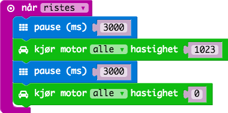
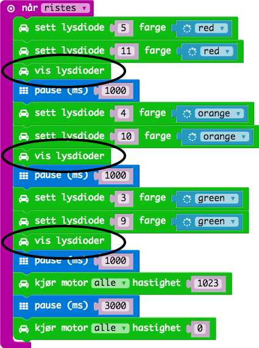
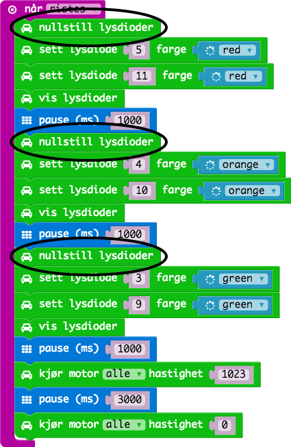

# Oppgave: Motorstyring

Denne oppgaven introduserer barna til å styre bilen vi har bygget. Vi skal
til slutt i oppgaven kjøre bilen med lys og lyd.

Først skal vi kjøre fremover i 3 sekunder når bilen ristes.

La oss vente i 3 sekunder med å kjøre bilen slik at vi greier å sette
den fra oss.

La lysene telle ned for oss for hvert sekund. En farge for hvert sekund som
nærmer seg start.

Lysene lyser ikke opp. Det er fordi vi trenger også å kjøre instruksjonen
"vis lysdioder".

For at bare ett av lysene (på hver side) vises samtidig må vi også passe
på å nullstille lysdiodene.

La oss også gi ett lydsignal på siste nedtelling.

Det som er problemet vårt nå er at den stopper aldri. Når bilen starter
å kjøre så utløses en "riste"-bevegelse og hele koden startes på nytt.
Prøv litt å finn ut hva som er den beste "start"-bevegelsen.

## Ferdig Kode

Her finner du ferdig JavaScript kode for oppgavene:

* [Kjøre](code-1.js)
* [Kjøre med led](code-2.js)
* [Kjøre med led og lyd](code-3.js)
