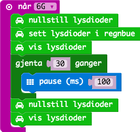

# Oppgave: Regnbue

I denne oppgaven skal vi beholde koden før, men ved ett krasj skal vi
vise regnbuefarger på lysene og rulle disse i 3 sekunder.

Når ett krasj inntreffer så skal vi slå på regnbuefarger på alle lysene.

Gjenta en løkke 30 ganger med 100 ms pause.

Etter hele løkken er kjørt må vi slå av lysene. For å gjøre det må vi
slette fargen på lysene også vise dem igjen.

Inne i løkken kan vi da rotere lysene slik av i får en fin regnbue-effekt.
Husk at for hver slik operasjon må man kalle "vis lysdioder".

Til slutt kan man prøve å erstatte "roter lysdioder" med "skift lysdioder"
for å se hvordan det ser ut.

## Ferdig Kode

Her finner du ferdig JavaScript kode for oppgavene:

* [Kode](code.js)
