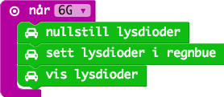
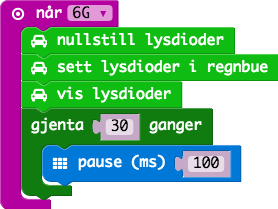

# Oppgave: Regnbue

I denne oppgaven skal vi beholde koden før, men ved ett krasj skal vi
vise regnbuefarger på lysene og rulle disse i 3 sekunder.

## Ferdig Kode

Her finner du ferdig JavaScript kode for oppgavene:

* [Kode](code.js)
