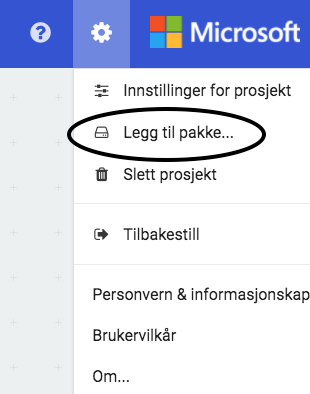
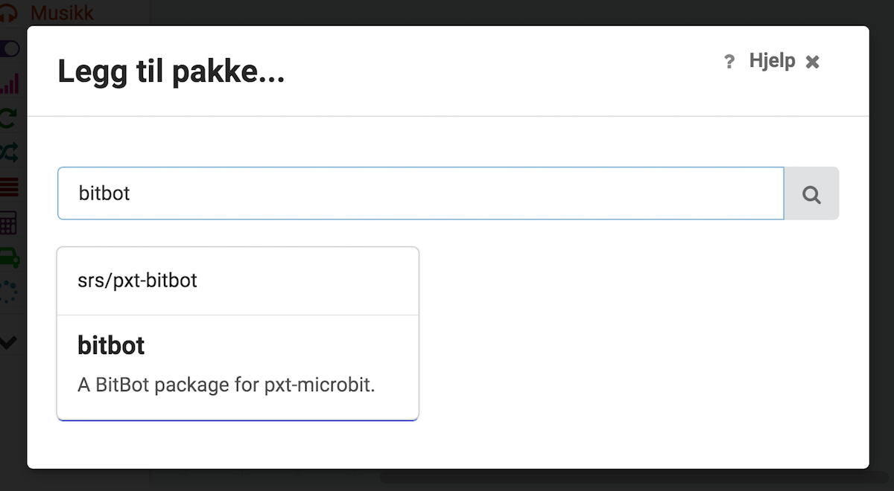
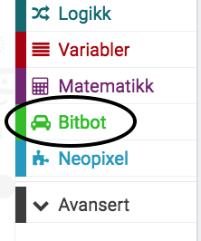

# Oppsett

Gå til https://pxt.microbit.org/?lang=no. Klikk tannhjulet så
"Legg til pakke...".

Deretter skriv inn URL til BitBot pakken https://github.com/srs/pxt-bitbot
i søkefeltet og trykk enter. Klikk så på pakken som kommer opp.

Etter dette skal man ha to nye valg i blokk-menyen: BitBot og Neopixel.

