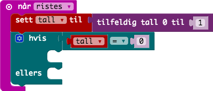

# Oppgave: Myntkast

Nå skal vi lage et program som gir oss enten mynt eller kron når vi
rister på MicroBit'en. En firkant representerer mynt og ett kryss
representerer kron.

Først må vi lage en variabel `tall`, deretter sette dette til et tilfeldig
tall (0 eller 1).

Så må vi lage en betingelse blokk som har to valg. `tall = 0` og når `tall`
ikke er `0`.

Vis et ikon (firkant) når `tall = 0`.

Vis et ikon (kryss) når `tall != 0`.

## Ferdig Kode

Her finner du ferdig JavaScript kode som man kan kopere inn i kode-feltet:

* [Kode](code.js)
