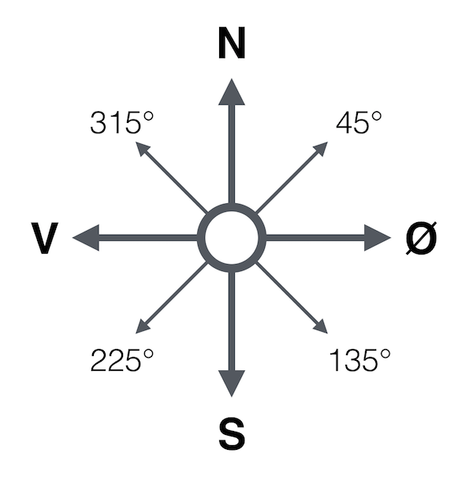
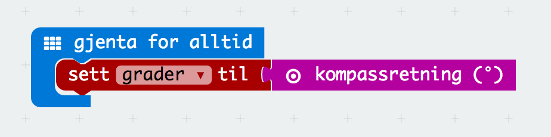
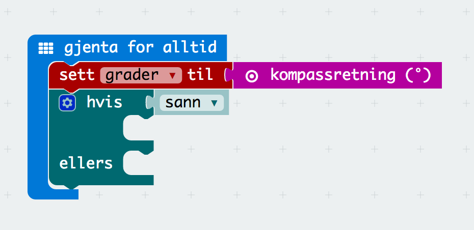
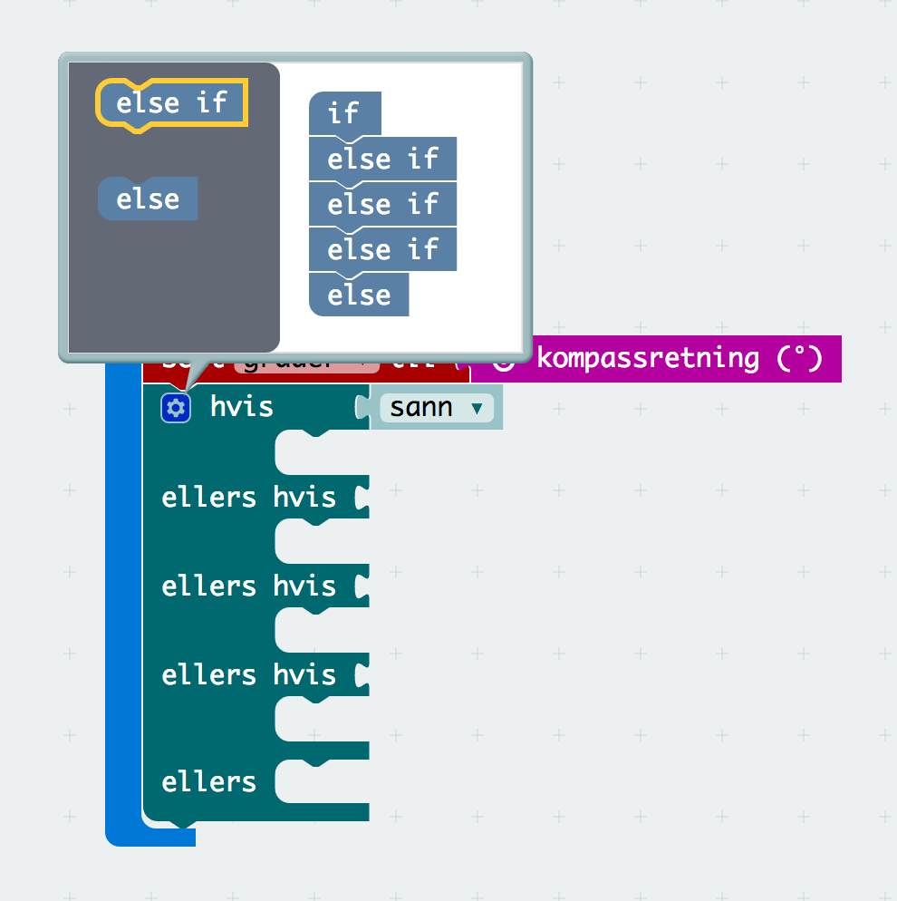
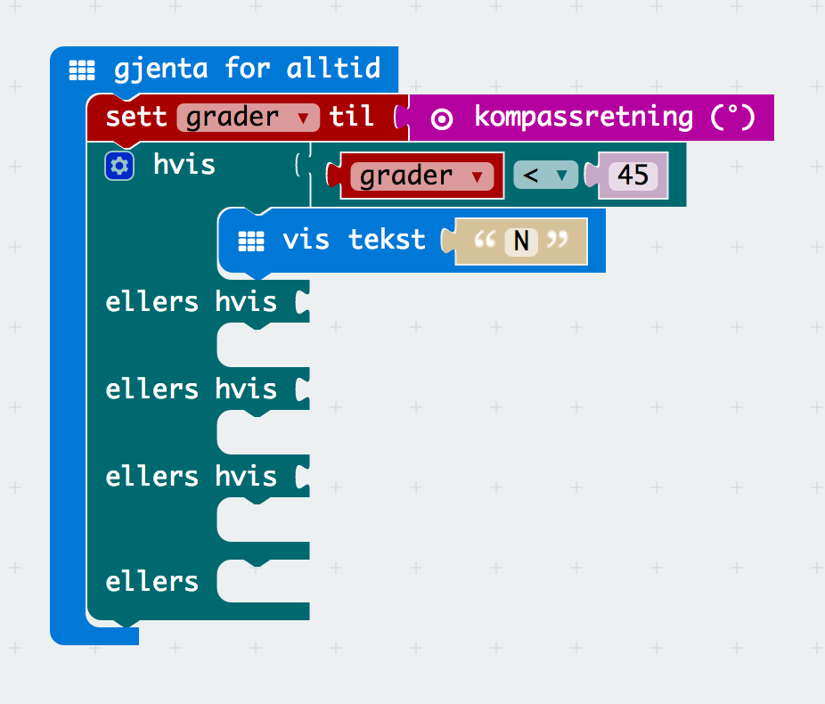
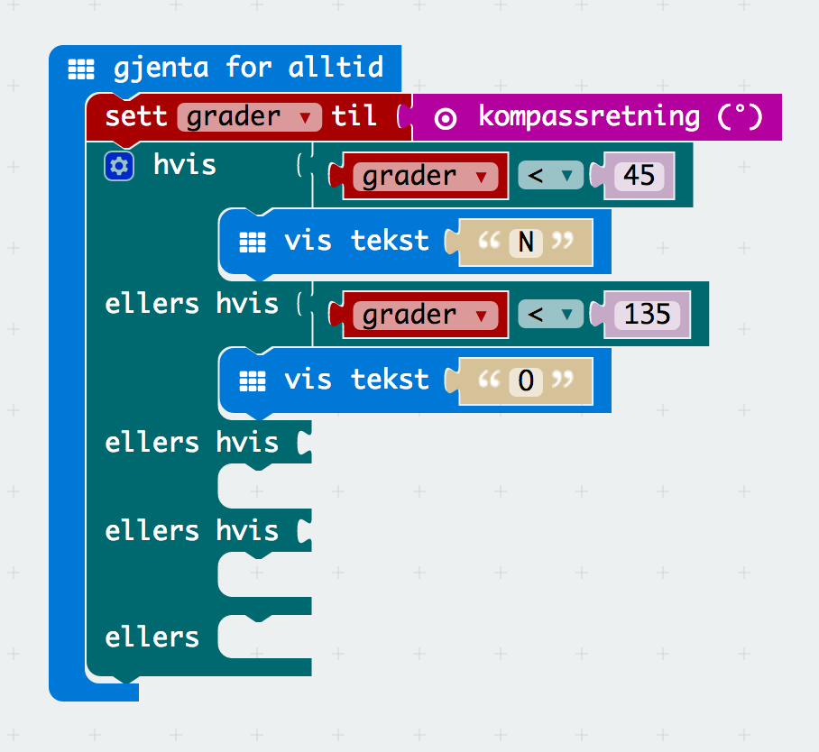
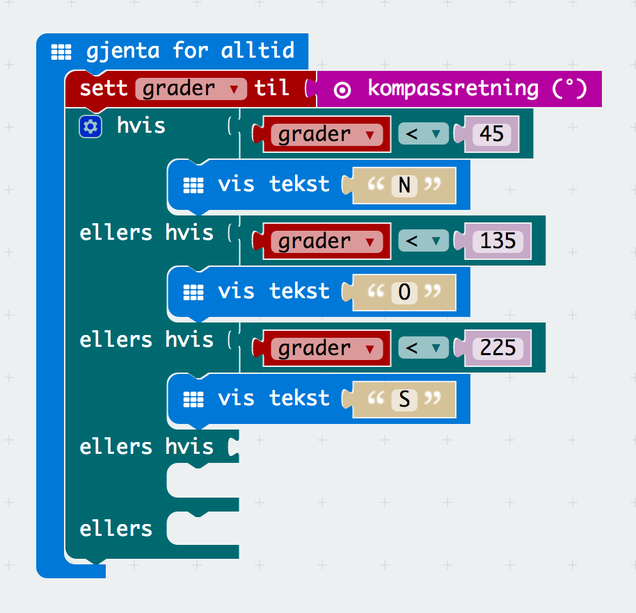
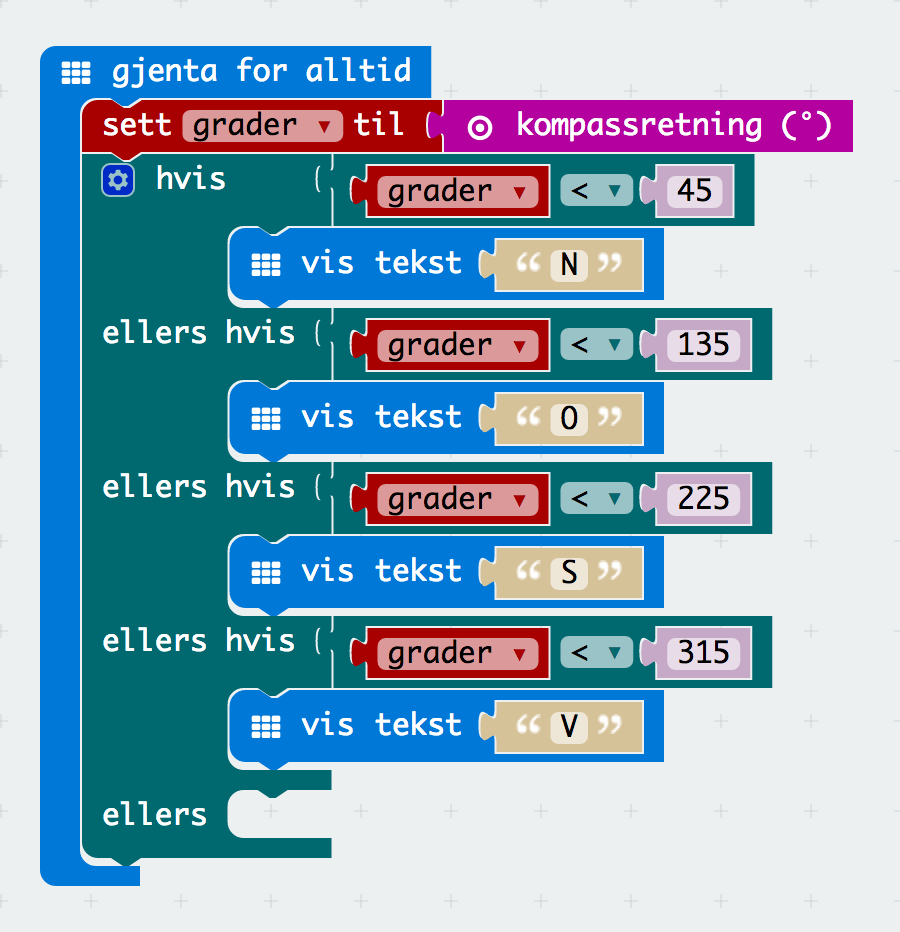
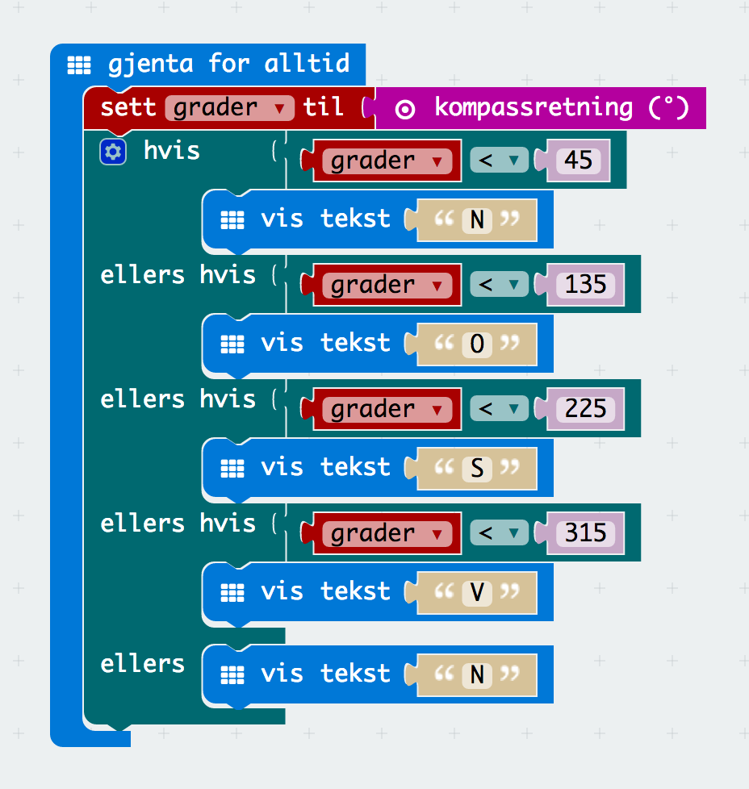
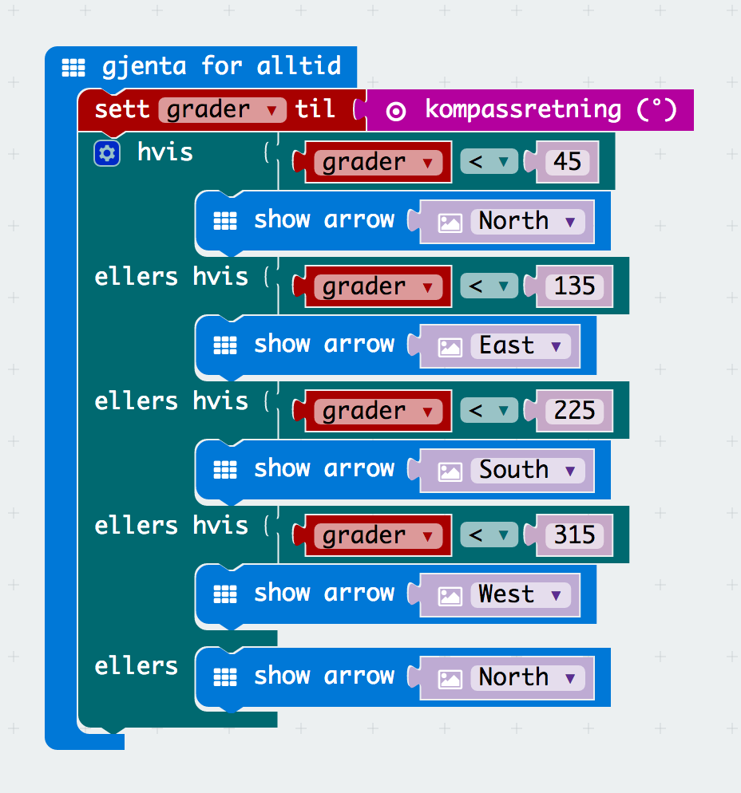

# Oppgave: Kompass

I denne oppgaven skal vi lage ett kompass. Når vi peker nordover skal
det stå `N` på skjermen, når vi peker mot sør skal det stå `S` på skjermen osv.

På MicroBit'en kan vi få ut kompassretningen i antall grader. For øst så vil
retningen være mellom 45 og 135 grader.

Først lager vi en variabel `grader` og setter denne til kompassretningen. Hele
blokken skal kjøre hele tiden for å gi kontinuerlig retning.

Vi må nå lage en betingelsesblokk som skal ha flere `ellers hvis` blokker.
Fem forskjellige betingelser totalt.

For å få til dette må man trykke på tannhjulet og dra `else if` fra den grå
delen inn på den hvite delen.

## Ferdig Kode

Her finner du ferdig JavaScript kode som man kan kopere inn i kode-feltet:

* [Kompass med tekst](code-1.js)
* [Kompass med piler](code-2.js)
