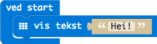
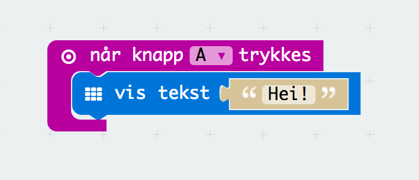
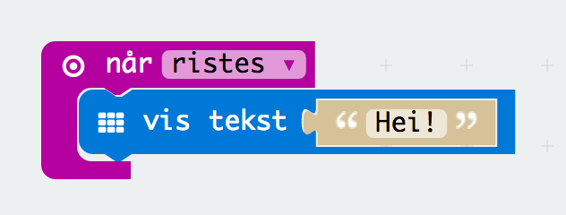

# Oppgave: Hei

Denne oppgaven er for å bli litt kjent med hvordan man programmerer i PXT
grensesnittet.

Det første vi skal gjøre er å skrive ut `Hei!` på skjermen når programmet
starter.

La oss endre denne ved at man skriver `Hei!` bare når venstre knapp er
trykket.

... snake ...

