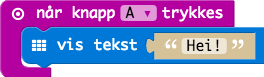
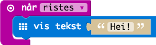

# Oppgave: Hei

Denne oppgaven er for å bli litt kjent med hvordan man programmerer i PXT
grensesnittet.

Det første vi skal gjøre er å skrive ut `Hei!` på skjermen når programmet
starter.

La oss endre denne ved at man skriver `Hei!` bare når venstre knapp (knapp `A`)
er trykket.

Gjør det samme, men bare når man rister på MicroBit'en.

## Ferdig Kode

Her finner du ferdig JavaScript kode som man kan kopere inn i kode-feltet:

* [Kode 1](code-1.js)
* [Kode 2](code-2.js)
* [Kode 3](code-3.js)
