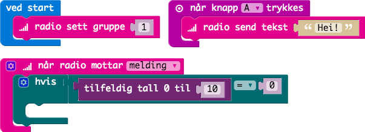
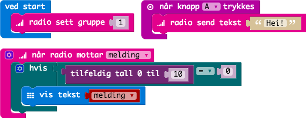

# Oppgave: Radio

I denne oppgaven skal vi skrive kode som både sender en melding og samtidig
tar i mot en melding.

Vi starter med å sette radioen i gruppen vi er medlem i. Dette på grunn av
at vi ikke vil sende til alle men bare de som er medlem i vår gruppe.

La oss sende en melding når vi trykker på `A`-knappen. Meldingen kan være
hva som helst.

Så skriver vi kode for å motta meldinger. Først lager vi en variabel `tekst`
som skal inneholde meldingen. For at ikke meldingen skal vises for alle
så skriver vi ut meldingen tilfeldig.

Bruker ett tilfeldig tall mellom `0` og `10`. Bare skriv ut meldingen når
tallet er `0`.

Her er hele koden som viser meldingen tilfeldig.

## Ferdig Kode

Her finner du ferdig JavaScript kode som man kan kopere inn i kode-feltet:

* [Kode](code.js)
